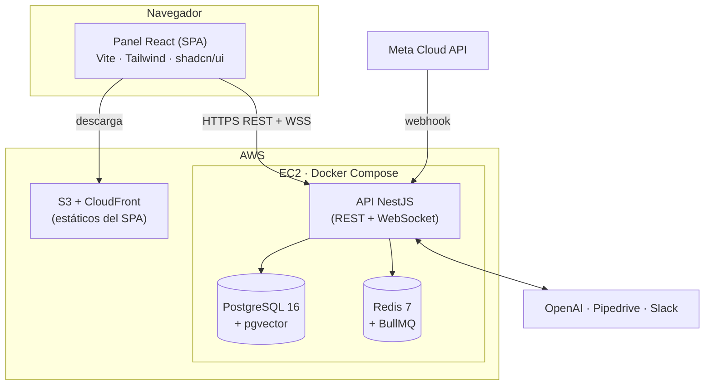
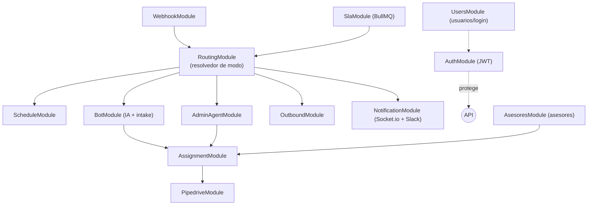

# 02 · Arquitectura (Vista General)

[[00 - Índice|← Índice]]

Documento "paraguas" de arquitectura. El detalle por capa está en:
- [[13 - Arquitectura de Software (Backend)]] — NestJS, módulos, JWT, Prisma, colas.
- [[14 - Arquitectura de Software (Frontend)]] — React, routing, auth, estado, tiempo real.
- [[07 - Infraestructura]] — despliegue físico en AWS.

## Estilo arquitectónico

**Monolito modular** en NestJS (no microservicios). Para el volumen esperado (<1,000 conversaciones/mes) es más barato, simple de operar y suficiente. La separación en servicios queda como evolución futura (ver [[09 - Fases y Roadmap]]).

Principios:
- **Modularidad:** cada dominio es un módulo NestJS con frontera clara (controller/service/repo).
- **Separación de capas:** presentación → aplicación/dominio → infraestructura.
- **Dependencias hacia adentro:** la lógica de negocio no conoce detalles de Meta/OpenAI/Pipedrive (van tras adaptadores).
- **Asíncrono donde importa:** webhooks y SLA se procesan vía colas (BullMQ).

## Vista de contexto (C4 · nivel 1)

```mermaid
flowchart LR
    Cli["📱 Cliente<br/>(WhatsApp)"] <-->|conversación| Iris
    Adm["👤 Administrador<br/>/ Operador"] <-->|panel web| Iris
    Adm <-->|WhatsApp (agente admin)| Iris

    Iris["🟣 Iris<br/>(WhatsApp + IA + automatización)"]

    Iris <-->|Cloud API| Meta["Meta WhatsApp"]
    Iris <-->|texto/visión/tools| OpenAI["OpenAI"]
    Iris <-->|API + webhooks| Pipe["Pipedrive (CRM)"]
    Iris -->|alertas| Slack["Slack"]
    Iris -. notifica .-> Ase["📱 Asesor<br/>(WhatsApp personal)"]
```

## Vista de contenedores (C4 · nivel 2)



> **Vista física (despliegue)** detallada en [[07 - Infraestructura]] (EC2 t3.small + Docker Compose, ECR, S3+CloudFront, Route53/ACM).

## Componentes del backend (resumen)



Detalle de cada módulo, sus capas y dependencias en [[13 - Arquitectura de Software (Backend)]].

## Stack tecnológico

> Versiones **indicativas** (fijar al iniciar el repo).

| Capa | Tecnología | Versión aprox. | Justificación |
|---|---|---|---|
| Runtime | Node.js | **22 LTS** | Fijar con `.nvmrc` + `engines` (el equipo tiene 24 instalado → usar nvm) |
| Lenguaje | TypeScript | 5.x | Tipado en back y front |
| Gestor de paquetes | **pnpm** | — | Rápido, eficiente en disco (back y front) |
| Backend | NestJS | 11 | Estructura modular, DI, decoradores |
| ORM | Prisma | 6 | Type-safety, migraciones; pgvector vía raw |
| Base de datos | PostgreSQL + pgvector | 16 / 0.8 | Relacional + RAG en la misma BD |
| Cache/colas | Redis + BullMQ | 7 / 5 | Sesiones, contexto, jobs de SLA |
| Auth | JWT (`@nestjs/jwt`, Passport) | — | Access + refresh, guards por rol |
| IA | OpenAI SDK | — | Texto, visión, tool calling |
| Tiempo real | Socket.io | 4 | Inbox en vivo, presencia |
| Docs API | `@nestjs/swagger` (OpenAPI) | — | Documenta la API y genera tipos del front |
| Testing | Jest + Supertest (back) · Vitest (front) | — | Unit + e2e |
| Calidad | ESLint + Prettier | — | Lint y formato |
| Contenedores | Docker + docker-compose | — | Dev (Postgres+Redis) · prod (stack completo en EC2) |
| Frontend | React + Vite | 19 / 6 | SPA privada, build estático |
| UI | Tailwind + shadcn/ui | 4 / — | Desarrollo rápido y consistente |
| Estado servidor | TanStack Query | 5 | Cache y sync con la API |
| Estado UI | Zustand (ligero) | — | Auth/socket/estado global mínimo |
| Infra | AWS EC2 + Docker Compose, ECR, S3+CloudFront | — | Costo mínimo a este volumen |

> Tooling completo del backend (seguridad, health, cron, validación de env, SDKs) en [[13 - Arquitectura de Software (Backend)]] §Stack y tooling.

## Calidad y transversales

- **Validación:** DTOs + `class-validator` / `ValidationPipe`.
- **Errores:** filtros de excepción globales; respuestas consistentes.
- **Config:** `@nestjs/config` + variables de entorno (sin secretos en repo).
- **Auditoría:** `tLog` unificado (registra asignaciones, integraciones, acciones del agente admin, eventos) con enums de categoría/motivo/nivel.
- **Observabilidad:** logs estructurados (pino/nestjs-logger) y métricas básicas.

Decisiones de arquitectura en [[10 - Registro de Decisiones]].
