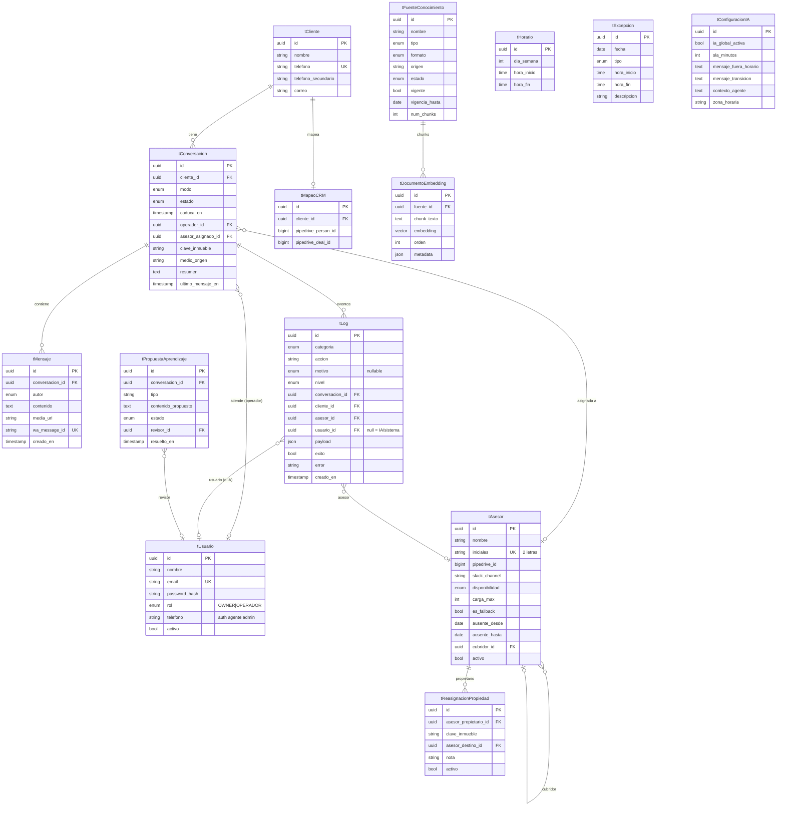

# 04 · Modelo de Datos

[[00 - Índice|← Índice]]

PostgreSQL + pgvector. Nomenclatura con prefijo `t` según convención del equipo. ORM: **Prisma** (pgvector vía raw queries para la búsqueda de similitud).

> Decisiones de modelado (24-jun-2026): **`tUsuario` (login) y `tAsesor` (ventas) separados** (D1) · **`tLog` unificado** que registra todo (asignaciones, integraciones, eventos), con enums de categoría/motivo (D2). Ver [[10 - Registro de Decisiones]].

## Diagrama entidad-relación

## Tablas

### Personas

| Tabla | Propósito |
|---|---|
| `tUsuario` | **Usuarios del panel (login)**: `nombre`, `email` (único), `password_hash`, `rol` (`OWNER` / `OPERADOR`), `telefono` (autoriza el agente admin por WhatsApp), `activo` (baja lógica) |
| `tAsesor` | **Asesores de ventas (no usan panel)**: `nombre`, `iniciales` (2 letras, único — prefijo de la clave), `pipedrive_id`, `slack_channel`, `disponibilidad`, `carga_max`, `es_fallback` (único), `ausente_desde/hasta`, `cubridor_id` (self-FK), `activo` (baja lógica) |
| `tCliente` | Contacto de WhatsApp: `nombre`, `telefono` (único), `telefono_secundario`, `correo` |

### Conversación (recepción)

| Tabla | Propósito |
|---|---|
| `tConversacion` | Hilo por cliente: `modo`, `estado` (Kanban), `caduca_en`, `operador_id`→`tUsuario` (quién atiende), `asesor_asignado_id`→`tAsesor` (al handoff), `clave_inmueble` (detectada), `medio_origen`, `resumen` (memoria, Fase 2), `ultimo_mensaje_en` |
| `tMensaje` | Cada mensaje: `autor` (`CLIENTE`/`IA`/`ADMINISTRATIVO`/`SISTEMA`), `contenido`, `media_url`, `wa_message_id` (único → idempotencia) |

### Asignación (config)

| Tabla | Propósito |
|---|---|
| `tReasignacionPropiedad` | Reglas `(asesor_propietario, clave_inmueble) → asesor_destino` + `nota`, `activo` |

### Horarios y configuración

| Tabla | Propósito |
|---|---|
| `tHorario` | `dia_semana` (0-6), `hora_inicio`, `hora_fin` (varias filas por día → turnos partidos/descansos) |
| `tExcepcion` | `fecha`, `tipo` (`FESTIVO`/`CIERRE`/`HORARIO_ESPECIAL`), `hora_inicio/fin`, `descripcion` |
| `tConfiguracionIA` | Singleton: `ia_global_activa` (kill-switch), `sla_minutos`, `mensaje_fuera_horario`, `mensaje_transicion`, `contexto_agente` (identidad/system prompt), `zona_horaria` |

### CRM e integraciones

| Tabla | Propósito |
|---|---|
| `tMapeoCRM` | Vínculo `tCliente` ↔ IDs de Pipedrive (`pipedrive_person_id`, `pipedrive_deal_id`) |

### Log unificado (auditoría e historial)

| Tabla | Propósito |
|---|---|
| `tLog` | **Registro de todo el sistema**: asignaciones/reasignaciones, sincronizaciones con Pipedrive/Slack/WhatsApp, acciones del agente admin, cambios de modo/estado, handoff, SLA, auth, etc. Campos: `categoria` (enum), `accion` (string), `motivo` (enum, nullable — p. ej. el de asignación), `nivel` (INFO/WARN/ERROR), refs nullable a `conversacion`/`cliente`/`asesor`/`usuario` (null = IA/sistema), `payload` (json), `exito`, `error`, `creado_en`. **El historial de asignaciones se consulta con `categoria = ASIGNACION`.** |

### Base de conocimientos (Fase 2)

| Tabla | Propósito |
|---|---|
| `tFuenteConocimiento` | Documento/fuente: `nombre`, `tipo` (`IDENTIDAD`/`POLITICA`/`MANUAL`/`FAQ`/`OTRO`), `formato`, `origen`, `estado`, `vigente`, `vigencia_hasta`, `num_chunks` |
| `tDocumentoEmbedding` | Chunks vectorizados (pgvector): `fuente_id`, `chunk_texto`, `embedding`, `orden`, `metadata` |
| `tPropuestaAprendizaje` | Autoaprendizaje: `conversacion_id`, `tipo`, `contenido_propuesto`, `estado`, `revisor_id` |

## Enumeraciones

| Enum | Valores |
|---|---|
| `RolUsuario` | `OWNER` · `OPERADOR` |
| `Disponibilidad` | `DISPONIBLE` · `OCUPADO` · `FUERA` |
| `ModoConversacion` | `AUTO` · `HUMANO_ACTIVO` · `FORZAR_IA` · `FORZAR_HUMANO` ([[Flujos/01 - Mensaje Entrante (Resolvedor de Modo)]]) |
| `EstadoConversacion` | `NUEVO` · `EN_ATENCION` · `EN_ESPERA_CLIENTE` · `EN_ESPERA_RESPUESTA` · `ASIGNADO` · `PERDIDO` · `CERRADO` ([[Flujos/04 - Handoff y Kanban de Recepción]]) |
| `AutorMensaje` | `CLIENTE` · `IA` · `ADMINISTRATIVO` · `SISTEMA` |
| `MotivoAsignacion` | `DIRECTA` · `REASIGNACION_PROPIEDAD` · `REASIGNACION_AUSENCIA` · `FALLBACK` · `MANUAL` (usado por `tLog.motivo`) |
| `CategoriaLog` | `CONVERSACION` · `ASIGNACION` · `INTEGRACION` · `AGENTE_ADMIN` · `AUTENTICACION` · `CONOCIMIENTO` · `SISTEMA` |
| `NivelLog` | `INFO` · `WARN` · `ERROR` |
| `TipoExcepcion` | `FESTIVO` · `CIERRE` · `HORARIO_ESPECIAL` |
| `TipoFuente` | `IDENTIDAD` · `POLITICA` · `MANUAL` · `FAQ` · `OTRO` |
| `FormatoFuente` | `PDF` · `DOCX` · `XLSX` · `PPTX` · `URL` · `TEXTO` |
| `EstadoFuente` | `PENDIENTE` · `INDEXADO` · `ERROR` |
| `EstadoPropuesta` | `PENDIENTE` · `APROBADA` · `RECHAZADA` |

## Notas de integridad

- **Baja lógica** (`activo=false`) en `tUsuario` y `tAsesor`: nunca se borran (conservan historial e IDs de Pipedrive).
- **`es_fallback` único**: un solo asesor fallback activo a la vez (validar en app o índice parcial).
- **`iniciales` único** entre asesores activos (prefijo de la clave).
- **`wa_message_id` único**: idempotencia al reprocesar webhooks (RNF-06).
- **`tConfiguracionIA`** es singleton (una fila).
- **`tLog`**: índices por `categoria`, `creado_en` y refs (`conversacion_id`, `asesor_id`) para consultas de historial/auditoría. Todas las refs son nullable (un evento de sistema puede no tener conversación). `usuario_id` nulo ⇒ acción de la IA/sistema.

## Clave del inmueble (referencia)

La clave (ej. `HRCVCENTRO01`) codifica asesor dueño + tipo de propiedad/negocio + identificador. Es la fuente de la asignación. Detalle en [[Flujos/03 - Asignación (resolverAsesorDestino)]].
