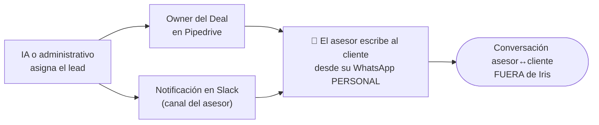

# 05 · Roles y Permisos

[[00 - Índice|← Índice]]

> **Iris opera sobre el número de WhatsApp _de la empresa_ (recepción).** Solo hay **dos roles humanos en el panel** (Administrador/Owner y Administrativo de oficina) más la **IA** como actor virtual. **Los asesores NO son usuarios del sistema.**

## Roles del panel

| Rol | Permisos |
|---|---|
| **Administrador / Owner** | Acceso total: ve todas las conversaciones y asesores; configura horarios y reglas de asignación; gestiona la lista de asesores (altas/bajas, ausencias, cubridores, fallback); controla el kill-switch de IA; ve métricas globales |
| **Administrativo de oficina** (operador) | Primer punto de contacto y triage: ve las conversaciones del número de empresa; identifica la clave del inmueble; asigna/reasigna clientes a asesores; responde en horario desde el panel; monitorea SLA |
| **IA** (actor virtual) | Responde al cliente fuera de horario; hace el intake (obtiene la clave); califica; asigna vía `resolverAsesorDestino`; escala. También es **agente administrativo por WhatsApp** para operador/owner. No ocupa asiento de panel |

## El asesor (fuera del panel)

El **asesor no es un rol del sistema**. Cuando se le asigna un cliente:

- Recibe el lead como **owner del Deal en Pipedrive** + **notificación en Slack** (a su canal).
- Atiende al cliente desde su **WhatsApp personal**.
- Esa conversación asesor↔cliente **ocurre fuera de Iris** (Iris no la registra).

## Implicaciones

- **Métricas:** Iris mide solo **recepción** (leads captados, atendidos por IA vs. administrativo, tiempo de respuesta, perdidos). La **conversión** del lead se mide en **Pipedrive**. Ver [[08 - Costos]] y [[06 - Integraciones]].
- **Equipo CrossHome:** 10 asesores (cada uno con iniciales, ID Pipedrive y canal Slack) + 2 administrativos (rol operador) + owner.
- **Seguridad:** el agente IA administrativo por WhatsApp solo acepta acciones de números autorizados con rol operador/owner (RNF-02). Ver [[Flujos/05 - Agente IA Administrativo]].
