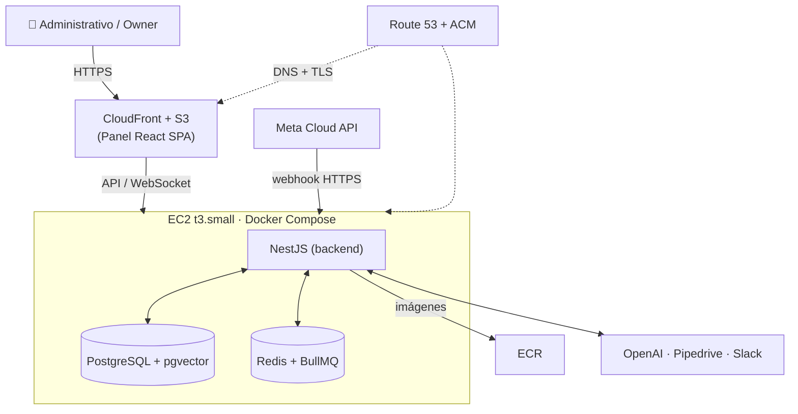

# 07 · Infraestructura

[[00 - Índice|← Índice]]

Punto de partida deliberadamente **simple**: un solo EC2 con Docker Compose. Escalable a futuro (ver [[09 - Fases y Roadmap]]).

## Servicios AWS

| Servicio | Uso |
|---|---|
| **EC2** (t3.small) | NestJS + PostgreSQL + Redis vía Docker Compose |
| **ECR** | Registro de imágenes Docker del backend |
| **S3 + CloudFront** | Hosting estático del panel React (SPA) |
| **Route 53 / ACM** | Dominio y certificados SSL |

## Diagrama de despliegue

## Por qué no ECS/Fargate en el MVP

ECS/Fargate obligaría a usar **RDS + ElastiCache** (Postgres y Redis no corren bien en Fargate), elevando el costo a ~$35–55/mes sin beneficio a este volumen. Es la opción de la **fase de escalamiento**, no del arranque.

## Ruta de evolución (cuando crezca el volumen)

1. BD → **RDS**.
2. Redis → **ElastiCache**.
3. Backend → **ECS Fargate** con autoescalado.

## Entornos y Docker

| Entorno | Qué corre en Docker | API |
|---|---|---|
| **dev** (local) | `docker-compose.dev.yml`: **Postgres + Redis** | Fuera del contenedor, hot-reload (`pnpm start:dev`) |
| **prod** (EC2, MVP) | `docker-compose`: **API (imagen de ECR) + Postgres + Redis** | En contenedor; persistencia con volúmenes + backups |

- **`Dockerfile` multi-stage** para la imagen de la API (build → runtime liviano) → se publica en **ECR**.
- Un **staging** opcional se evalúa según necesidad.
- A escala, Postgres y Redis salen de Docker a **RDS / ElastiCache** (ver ruta de evolución arriba).

## Pendientes de infraestructura

- Dominio y subdominios (panel / API / webhook).
- Verificación de **Meta Business** y aprobación de plantillas. Ver [[10 - Registro de Decisiones]].
