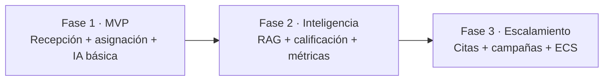

# 09 · Fases y Roadmap

[[00 - Índice|← Índice]]

## Roadmap

## Fase 1 — MVP

- WhatsApp Cloud API conectada y verificada.
- Backend NestJS: webhook, **resolvedor de modo** (routing por horario), envío de mensajes.
- **Intake de clave** (dictado, link de portal, foto del cartel con visión).
- **`resolverAsesorDestino`** nativo (clave + reglas de reasignación + ausencias + fallback) — reemplaza Make.
- **Handoff**: mensaje de transición + cierre del hilo.
- Panel React: **inbox tipo Kanban**, tomar/liberar, asignar/reasignar, toggle de IA.
- **Panel de asignación manual** (formulario independiente, reemplaza el Google Form de Make).
- **Gestión de asesores** (CRUD + baja lógica, ausencias, cubridores, fallback, disponibilidad/carga).
- Configuración de **horarios**, descansos y excepciones; **reglas de reasignación**; kill-switch y mensajes de IA.
- Detalle de vistas en [[12 - Frontend (Estructura y Vistas)]].
- Roles administrador/operador.
- Integración Pipedrive básica (Person/Lead/Deal, owner, nota resumen).
- Notificaciones a Slack (nuevo lead, asignación, escalamiento, SLA).
- **Agente IA administrativo** por WhatsApp (acciones básicas: asignar/reasignar/consultar).
- **Contexto/identidad del agente** configurable + RAG mínimo (FAQs/políticas básicas). Ver [[15 - Base de Conocimientos (RAG)]].
- Despliegue en AWS (EC2 + S3/CloudFront).

## Fase 2 — Inteligencia y seguimiento

- **Base de conocimientos completa** ([[15 - Base de Conocimientos (RAG)]]): ingestión multi-formato (PDF/DOCX/XLSX/PPTX), trazabilidad de fuentes, **autoaprendizaje supervisado**, memoria e identidad multicanal, playground.
- Clasificación y calificación automática de leads.
- Dashboard de **métricas de recepción** ampliado.
- Slack con **acciones interactivas** (Block Kit: tomar/reasignar desde Slack).

## Fase 3 — Escalamiento y automatización

- Agenda de citas / visitas.
- Campañas y envíos masivos (plantillas).
- Seguimiento automático de prospectos.
- Migración a **ECS Fargate** (RDS + ElastiCache) si el volumen lo exige.
- Multi-tenant para **comercializar Iris** a otras empresas.

## Próximos pasos inmediatos

1. Cerrar decisiones abiertas (ver [[10 - Registro de Decisiones]]): horarios/zona horaria, número de WhatsApp, etapas reales de Pipedrive, lista real de asesores.
2. Validar los [[Flujos/00 - Índice de Flujos|flujos]] con CrossHome.
3. Generar el esqueleto del backend NestJS + Prisma schema.
4. Configurar WhatsApp Cloud API y verificación de Meta Business.
5. Estimar horas de desarrollo por fase (cotización).
