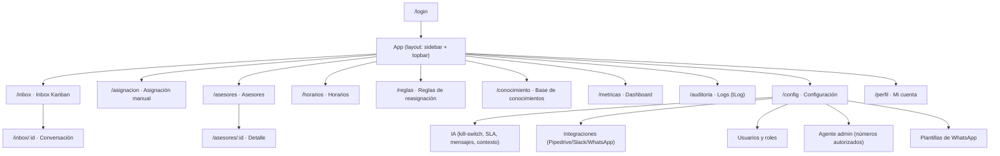
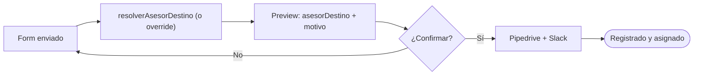

# 12 · Frontend — Estructura y Vistas

[[00 - Índice|← Índice]] · arquitectura técnica en [[14 - Arquitectura de Software (Frontend)]]

Panel **React + Vite (SPA)**, privado tras login. Lo usan **Administrador/Owner** y **Administrativo/Operador** (los asesores no, ver [[05 - Roles y Permisos]]). UI: Tailwind + shadcn/ui · datos: TanStack Query · tiempo real: Socket.io.

> Convención de cada vista: **Objetivo · Acceso · Contenido · Acciones · Datos/Estados · RFs**.

## Mapa de navegación (sitemap)



## Acceso por rol

| Vista | Operador | Owner |
|---|---|---|
| Inbox Kanban + Conversación | ✅ | ✅ |
| Asignación manual | ✅ | ✅ |
| Asesores | ✅ ver/editar | ✅ CRUD |
| Horarios | ✅ | ✅ |
| Reglas de reasignación | ✅ | ✅ |
| Base de conocimientos | ✅ gestionar/aprobar | ✅ |
| Métricas | ✅ | ✅ |
| Auditoría / Logs | ❌ | ✅ |
| Configuración (IA, integraciones, usuarios, agente admin, plantillas) | ❌ | ✅ |
| Perfil / mi cuenta | ✅ | ✅ |

---

## 0. Login — `/login`

- **Objetivo:** autenticar al usuario (JWT) y entrar al panel.
- **Acceso:** público.
- **Contenido:** formulario email + contraseña; logo Iris.
- **Acciones:** iniciar sesión → redirige a `/inbox`. (Recuperar contraseña: Fase 2.)
- **Estados:** error de credenciales, cargando, bloqueo por intentos (opcional).
- **RFs:** RF-29. Auth técnica en [[14 - Arquitectura de Software (Frontend)]] §Auth.

---

## 1. Inbox Kanban — `/inbox`

- **Objetivo:** operar las conversaciones de recepción de WhatsApp por estado (ver [[Flujos/04 - Handoff y Kanban de Recepción]]).
- **Acceso:** operador, owner.
- **Contenido:**
  - **Columnas:** `NUEVO`, `EN_ATENCION`, `EN_ESPERA_CLIENTE`, `EN_ESPERA_RESPUESTA`, `ASIGNADO`, `PERDIDO`, `CERRADO`.
  - **Tarjeta:** nombre/teléfono, último mensaje, quién atiende (IA/administrativo), tiempo en estado, badge de SLA, modo (`AUTO`/`FORZAR_IA`…).
  - **Filtros:** estado, administrativo, modo; búsqueda por teléfono/nombre.
- **Acciones:** abrir conversación; **mover tarjeta entre columnas = cambiar el estado del chat** (`tConversacion.estado`). El Kanban es simplemente la gestión del estado de la conversación; algunos estados los pone el sistema (`NUEVO` al entrar, `ASIGNADO` al hacer handoff) y otros el administrativo.
- **Datos/Estados:** tiempo real por WebSocket (nuevas conversaciones y cambios de estado); estado vacío por columna; contador de "sin SLA".
- **RFs:** RF-02, RF-03, RF-08.

```
┌──────────────────────────────────────────────────────────────────────┐
│ Inbox            [buscar…]  [filtros ▾]                    🔴 3 sin SLA │
├─────────┬───────────┬───────────────┬───────────────┬─────────────────┤
│ NUEVO   │ EN_ATENC. │ EN_ESPERA_CLI │ EN_ESPERA_RESP│ ASIGNADO        │
│ ┌─────┐ │ ┌───────┐ │ ┌───────────┐ │ ┌───────────┐ │ ┌─────────────┐ │
│ │Juan │ │ │Ana 🤖 │ │ │Luis (clave│ │ │Pedro ⏱2m  │ │ │Marta→H.Guev.│ │
│ └─────┘ │ └───────┘ │ └───────────┘ │ └───────────┘ │ └─────────────┘ │
└─────────┴───────────┴───────────────┴───────────────┴─────────────────┘
```

### 1.1 Conversación — `/inbox/:id`

- **Objetivo:** atender un chat y, al calificar, **asignar** el lead.
- **Contenido:** hilo estilo WhatsApp Web (mensajes con autor IA/administrativo/cliente; soporta imágenes/audio); **panel lateral** con datos del cliente, **clave detectada**, modo actual, enlace al Deal en Pipedrive.
- **Acciones:** enviar mensaje; **tomar / liberar**; **activar IA por tiempo** (`caduca_en`); cambiar modo; **asignar a asesor** (sugiere `asesorDestino` + motivo, permite override → dispara **handoff**: mensaje de transición + cierre).
- **Estados:** "IA escribiendo", mensaje no entregado, conversación cerrada (solo lectura).
- **RFs:** RF-01, RF-04, RF-05, RF-15, RF-16, RF-18. Ver [[Flujos/03 - Asignación (resolverAsesorDestino)]].

---

## 2. Asignación manual — `/asignacion`

- **Objetivo:** registrar y asignar un lead que **no entró por WhatsApp** (llamada, presencial, portal sin chat). Reemplaza al Google Form de Make.
- **Acceso:** operador, owner.
- **Contenido (campos):**

| Campo | Notas |
|---|---|
| ¿Quién registra? | Auto = usuario en sesión |
| Nombre del cliente | obligatorio |
| Teléfono principal | obligatorio (match en Pipedrive) |
| Teléfono secundario | opcional |
| Correo | opcional |
| **Clave del inmueble** | crítico → deriva el asesor |
| Valor del inmueble | opcional |
| Medio de contacto / origen | Inmuebles24, ML, Lamudi, recomendación, cartel… |
| Notas | opcional |
| **Reasignación de asesor (override)** | opcional; ignora la clave |

- **Acciones:** al enviar → **preview** del asesor calculado + motivo (directa/reasignación/ausencia/fallback) → confirmar → Pipedrive (match/crear Person+Deal) + Slack al asesor.
- **Estados:** validación de campos, clave inválida, cliente ya existente (avisa), confirmación.
- **RFs:** RF-27.



---

## 3. Asesores — `/asesores`

- **Objetivo:** gestionar los asesores y los datos que alimentan `resolverAsesorDestino`.
- **Acceso:** operador (ver/editar), owner (CRUD completo).
- **Contenido:** lista con nombre, iniciales, disponibilidad, carga actual/máx, fallback, estado (activo/ausente/inactivo).
- **Acciones rápidas:** marcar disponibilidad, marcar ausencia, activar/desactivar.
- **Estados:** lista vacía, asesor inactivo (atenuado), validación de iniciales únicas.
- **RFs:** RF-19, RF-20, RF-21, RF-22, RF-23.

### 3.1 Detalle / edición — `/asesores/:id`

| Campo | Detalle |
|---|---|
| Nombre | |
| **Iniciales** (2 letras) | **únicas**; prefijo de la clave |
| `pipedrive_id` | owner del deal |
| `slack_channel` | canal de notificaciones |
| Disponibilidad | disponible / ocupado / fuera |
| `carga_max` | máximo de leads simultáneos |
| **Es fallback** | único en el sistema |
| **Ausencia** | `ausente_desde` / `ausente_hasta` |
| **Cubridor** | asesor que recibe sus leads durante la ausencia |
| Activo | **baja lógica**: inactivo = no recibe leads, conserva historial |

> **Baja lógica (decidido):** "eliminar" = desactivar. Validar lista real (ver [[10 - Registro de Decisiones]] A-06).

---

## 4. Horarios — `/horarios`

- **Objetivo:** definir cuándo atiende personal vs. cuándo entra la IA (`horario_abierto()`, ver [[Flujos/01 - Mensaje Entrante (Resolvedor de Modo)]]).
- **Acceso:** operador, owner.
- **Contenido:**
  - **Horario semanal** (`tHorario`): por día, **varias filas** → turnos partidos y descansos (comida).
  - **Excepciones** (`tExcepcion`): `FESTIVO` / `CIERRE` / `HORARIO_ESPECIAL` con fecha y rango opcional.
  - **Zona horaria** + **kill-switch** global (`ia_global_activa`).
- **Acciones:** agregar/editar/eliminar tramos y excepciones; cambiar zona horaria.
- **RFs:** RF-06, RF-24.

```
Lun  09:00–14:00 · 16:00–19:00   (descanso 14–16)
Mar  09:00–19:00
Excepciones:  [+]   16-sep FESTIVO (IA todo el día)
```

---

## 5. Reglas de reasignación — `/reglas`

- **Objetivo:** CRUD de `tReasignacionPropiedad` `(asesor propietario, clave) → asesor destino` + nota.
- **Acceso:** operador, owner.
- **Contenido:** lista con búsqueda por clave o asesor; alta/edición/baja de regla.
- **Acciones:** crear/editar/desactivar regla.
- **RFs:** RF-26. Prioridad sobre la asignación directa en [[Flujos/03 - Asignación (resolverAsesorDestino)]].

---

## 6. Métricas — `/metricas`

- **Objetivo:** dashboard de **recepción** (la conversión vive en Pipedrive, ver [[08 - Costos]]).
- **Acceso:** operador, owner.
- **Contenido:** leads captados (por día/semana y por origen), atendidos por **IA vs. administrativo**, **tiempo de respuesta** y SLA, leads **asignados por asesor**, perdidos.
- **Acciones:** filtrar por rango de fecha; (exportar — Fase 2).
- **RFs:** RF-14.

---

## 7. Configuración — `/config` (solo Owner)

### 7.1 IA
- Kill-switch global, `sla_minutos`, `mensaje_fuera_horario`, `mensaje_transicion`, **`contexto_agente`** (identidad/tono/reglas — ver [[15 - Base de Conocimientos (RAG)]]).

### 7.2 Integraciones
- Estado y credenciales de **Pipedrive, Slack, WhatsApp Cloud API**; prueba de conexión.

### 7.3 Usuarios y roles
- CRUD de `tUsuario` (owner/operador), alta/baja, reset de contraseña.

### 7.4 Agente admin — números autorizados
- Lista de usuarios con `telefono` **autorizado** para dar comandos al **agente IA administrativo por WhatsApp** (RF-17); activar/desactivar autorización. Ver [[Flujos/05 - Agente IA Administrativo]].

### 7.5 Plantillas de WhatsApp *(Fase 2/3)*
- Gestión de **plantillas aprobadas por Meta** (mensajes iniciados por la empresa: utility/marketing/authentication): listar, ver estado de aprobación, crear/editar. Necesario para outbound proactivo y campañas.

- **RFs:** RF-12, RF-13, RF-17, RF-25, RF-28, RF-40, RF-41.

---

## 8. Base de conocimientos — `/conocimiento`

- **Objetivo:** gestionar el conocimiento que usa el agente IA (ver [[15 - Base de Conocimientos (RAG)]]).
- **Acceso:** operador (gestionar/aprobar), owner.
- **Contenido:**
  - **Fuentes/documentos:** lista con nombre, **tipo** (identidad/política/manual/FAQ), formato, **estado de indexación**, nº de chunks, vigencia. Acciones: **subir** (drag&drop), **re-indexar**, **desactivar**.
  - **Detalle de fuente** (`/conocimiento/:id`): metadatos, chunks extraídos, vigencia, categoría.
  - **Contexto/identidad del agente:** editor del *system prompt*.
  - **Propuestas de autoaprendizaje:** bandeja para **aprobar/rechazar**.
  - **Playground:** probar preguntas y ver respuesta **con fuentes citadas**.
- **RFs:** RF-30 a RF-38.

```
┌───────────────────────────────────────────────────────────┐
│ Base de conocimientos        [+ Subir documento]          │
├───────────────┬─────────┬──────────┬─────────┬────────────┤
│ Documento     │ Tipo    │ Estado   │ Chunks  │ Vigencia   │
│ Identidad CH  │IDENTIDAD│ Indexado │ 6       │ —          │
│ Política créd.│ POLÍTICA│ Indexado │ 22      │ —          │
│ Manual visitas│ MANUAL  │ Pendiente│ —       │ —          │
├───────────────┴─────────┴──────────┴─────────┴────────────┤
│ [Identidad del agente]  [Propuestas (3)]  [Playground]    │
└───────────────────────────────────────────────────────────┘
```

---

## 9. Auditoría / Logs — `/auditoria` (solo Owner)

- **Objetivo:** consultar el **log unificado** (`tLog`) de todo el sistema para auditoría y depuración.
- **Acceso:** owner.
- **Contenido:** tabla de eventos con **filtros**: `categoria` (CONVERSACION/ASIGNACION/INTEGRACION/AGENTE_ADMIN/AUTENTICACION/CONOCIMIENTO/SISTEMA), `nivel` (INFO/WARN/ERROR), asesor, usuario, conversación, **rango de fecha**; búsqueda por acción.
- **Acciones:** abrir detalle del evento (ver `payload` json, `motivo`, `exito`/`error`); (exportar — Fase 2). **Solo lectura.**
- **Estados:** sin resultados; paginación.
- **RFs:** RF-39 (nuevo). Modelo en [[04 - Modelo de Datos]] `tLog`.

```
┌──────────────────────────────────────────────────────────────┐
│ Auditoría   [categoría ▾][nivel ▾][asesor ▾][fechas]  [buscar]│
├──────────┬──────────────┬────────┬───────────────┬───────────┤
│ Fecha    │ Categoría    │ Nivel  │ Acción        │ Resultado │
│ 18:42    │ ASIGNACION   │ INFO   │ asignacion... │ ✅ →H.Guev│
│ 18:40    │ INTEGRACION  │ ERROR  │ pipedrive.deal│ ❌ 429    │
└──────────┴──────────────┴────────┴───────────────┴───────────┘
```

---

## 10. Perfil / mi cuenta — `/perfil`

- **Objetivo:** datos del usuario en sesión y seguridad.
- **Acceso:** todos los usuarios autenticados.
- **Contenido:** nombre, email, rol (solo lectura); **cambiar contraseña**.
- **Acciones:** actualizar contraseña; cerrar sesión.
- **RFs:** RF-42 (nuevo).

---

## Componentes transversales

- **Layout:** sidebar de navegación + **topbar** (usuario, **estado de IA global**, alertas de SLA, acceso a perfil).
- **Notificaciones en vivo** (toasts/socket): nuevo lead, escalamiento, SLA vencido.
- **Tabla reutilizable** (orden, filtro, paginación) para asesores/reglas/métricas/auditoría.
- **Selector de asesor** (con disponibilidad y carga) reutilizado en asignación manual y en el chat.

## Decisiones de UX (24-jun-2026)

- **Kanban = cambio de estado del chat.** Las columnas son los estados de `tConversacion`; mover una tarjeta cambia el estado. Sin lógica adicional ni restricciones especiales de arrastre.
- **Notificaciones = solo toasts en vivo** (socket). No hay centro de notificaciones / historial de alertas.

## Pendientes de UX

- Wireframes/diseño visual (Figma) — ver [[10 - Registro de Decisiones]].
