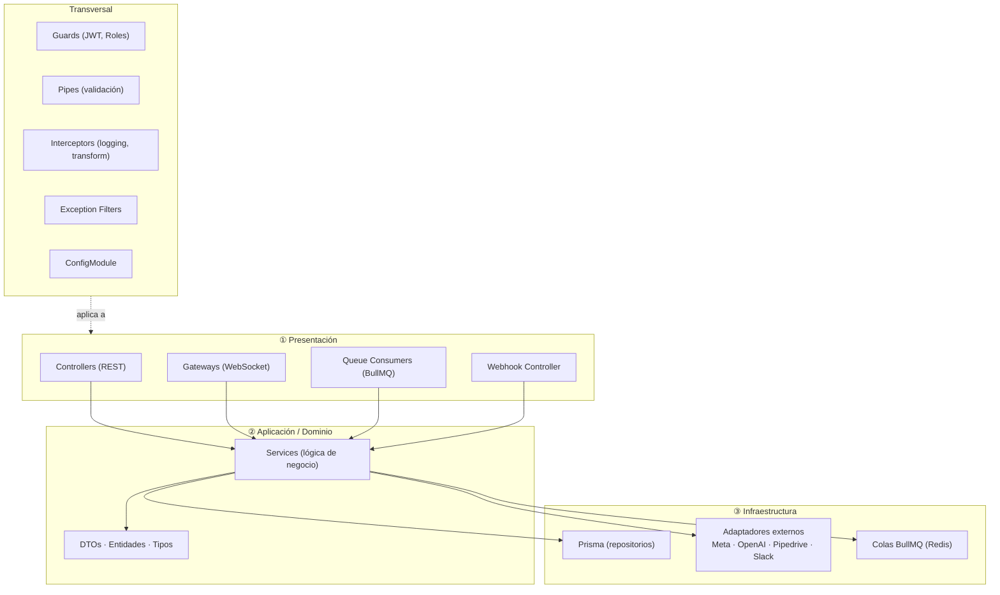
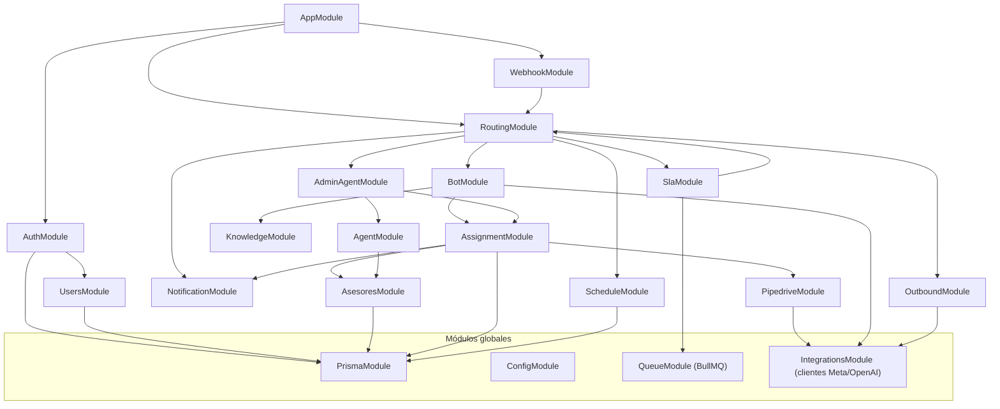
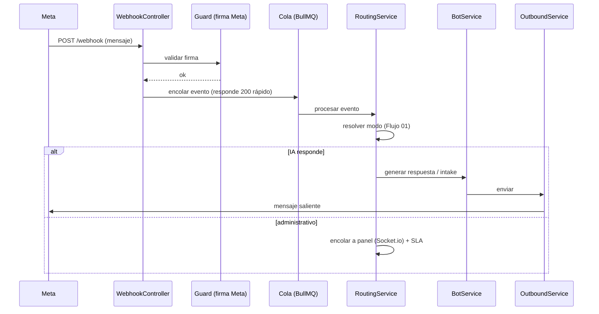
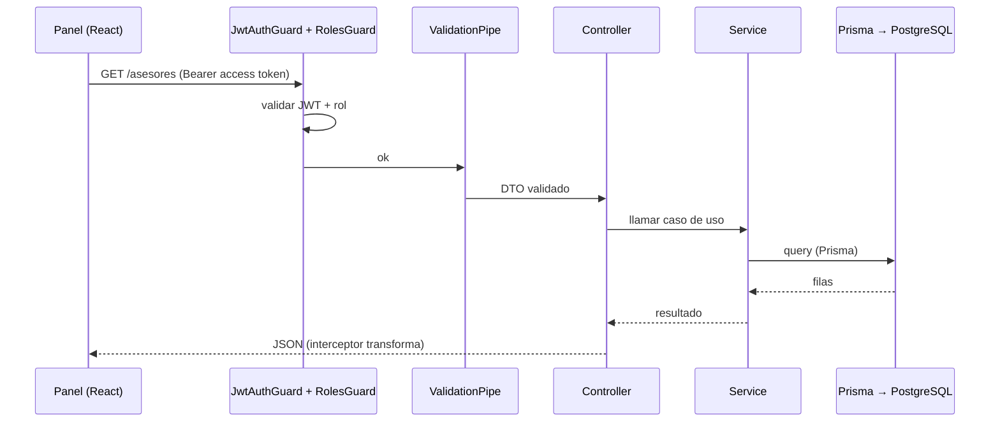
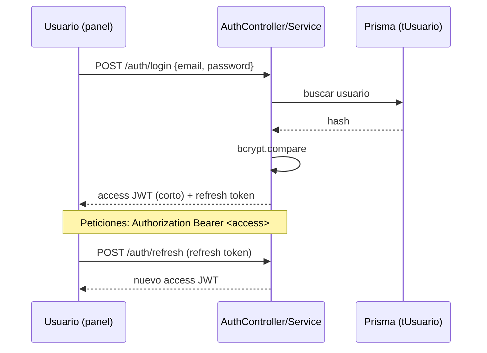
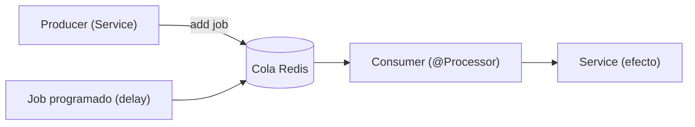

# 13 · Arquitectura de Software — Backend (NestJS)

[[00 - Índice|← Índice]] · [[02 - Arquitectura|← Arquitectura general]]

## Arquitectura en capas

Cada módulo NestJS respeta tres capas + transversales. Las dependencias apuntan **hacia adentro** (la presentación depende de la aplicación; la aplicación depende de abstracciones de infraestructura, no de detalles).



### Anatomía de un módulo

```
src/<modulo>/
├── <modulo>.module.ts        # declara providers, imports, exports
├── <modulo>.controller.ts    # rutas REST (capa presentación)
├── <modulo>.service.ts       # lógica de negocio (capa aplicación)
├── <modulo>.gateway.ts       # (opcional) WebSocket
├── dto/                      # DTOs de entrada/salida + class-validator
├── entities/                # tipos de dominio
└── <modulo>.consumer.ts      # (opcional) procesador de cola BullMQ
```

## Grafo de dependencias de módulos



### Responsabilidad de módulos

| Módulo | Capa principal | Depende de |
|---|---|---|
| `AuthModule` | Auth (JWT, login, guards) | Prisma, Users |
| `UsersModule` | Usuarios del panel (`tUsuario`, login, roles) | Prisma |
| `AsesoresModule` | Asesores de ventas (`tAsesor`: iniciales, Pipedrive/Slack, ausencias, cubridor, fallback) | Prisma |
| `WebhookModule` | Ingesta de Meta (valida firma) | Routing |
| `RoutingModule` | Resolvedor de modo | Schedule, Bot, AdminAgent, Outbound, Notification, Sla |
| `ScheduleModule` | `horario_abierto()` | Prisma |
| `BotModule` | IA + intake (texto/visión) | Assignment, Knowledge, Integrations(OpenAI) |
| `KnowledgeModule` | Base de conocimientos (RAG): ingesta, embeddings, búsqueda, autoaprendizaje | Prisma(pgvector), Integrations(OpenAI) |
| `AssignmentModule` | `resolverAsesorDestino` | Pipedrive, Notification, Users, Prisma |
| `AdminAgentModule` | Agente admin (tool calling) | Assignment, Agent, Pipedrive |
| `AgentModule` | Tomar/liberar, toggle IA | Users, Notification, Prisma |
| `OutboundModule` | Envío Cloud API | Integrations(Meta) |
| `NotificationModule` | Socket.io + Slack | Integrations(Slack) |
| `PipedriveModule` | Person/Deal/owner/notas | Integrations(Pipedrive), Prisma |
| `SlaModule` | Jobs de fallback | Queue(BullMQ), Routing |

## Ciclo de vida — mensaje entrante de WhatsApp



> El webhook **responde 200 de inmediato** y procesa en cola → resiliencia e idempotencia (RNF-05/06).

## Ciclo de vida — petición REST del panel



## Autenticación y autorización (JWT)



- **Access token** JWT de vida corta (ej. 15 min), firmado (`@nestjs/jwt` + Passport `JwtStrategy`).
- **Refresh token** de vida larga; recomendación: **cookie httpOnly + SameSite** (mitiga XSS). El access token se mantiene en memoria en el SPA.
- **Guards:** `JwtAuthGuard` (autenticación) + `RolesGuard` con decorador `@Roles('OWNER')` (autorización por rol — RNF-02).
- **Hash de contraseñas:** bcrypt/argon2.
- El **agente admin por WhatsApp** no usa JWT: autoriza por **número + rol** del remitente (ver [[Flujos/05 - Agente IA Administrativo]]).

## Capa de datos — Prisma

- **Schema** único (`schema.prisma`) como fuente de verdad → ver [[04 - Modelo de Datos]].
- **Migraciones** declarativas (`prisma migrate`) versionadas en el repo.
- **PrismaModule** global expone `PrismaService` (cliente) por inyección.
- **Repositorios:** los services usan `PrismaService`; para dominios complejos se puede envolver en un repositorio.
- **Transacciones:** `prisma.$transaction([...])` para operaciones atómicas (ej. crear Person+Deal+mapeo).
- **pgvector:** búsqueda de similitud (RAG, Fase 2) vía `prisma.$queryRaw` (Prisma no soporta el operador vectorial nativamente).
- **Idempotencia:** claves únicas (ej. `message_id` de Meta) para no duplicar al reprocesar webhooks.

## Colas y jobs — BullMQ



- **Eventos de webhook:** procesamiento asíncrono y reintentos con backoff.
- **Fallback SLA:** job con `delay` = `sla_minutos`; si nadie contestó, dispara la IA (Flujo 01).
- **Reintentos:** llamadas a Pipedrive/Slack/Meta con reintento y *dead-letter*.

## Transversales

- **ValidationPipe** global + DTOs con `class-validator`.
- **Exception filters** → respuestas de error consistentes.
- **Interceptors** → logging de request/response y *transform* de salida.
- **ConfigModule** → entornos y secretos por variables de entorno.
- **Logger** estructurado (pino).

## Estructura de carpetas (propuesta)

```
src/
├── main.ts
├── app.module.ts
├── common/            # guards, pipes, filters, interceptors, decorators
├── config/            # ConfigModule y validación de env
├── prisma/            # PrismaModule + PrismaService
├── auth/
├── users/             # tUsuario (login, roles)
├── asesores/          # tAsesor (ventas; no login)
├── webhook/
├── routing/
├── schedule/
├── bot/
├── knowledge/         # base de conocimientos (RAG, embeddings, autoaprendizaje)
├── assignment/
├── admin-agent/
├── agent/
├── outbound/
├── notification/
├── pipedrive/
├── sla/
└── integrations/      # clientes Meta / OpenAI / Pipedrive / Slack
prisma/
└── schema.prisma
```
