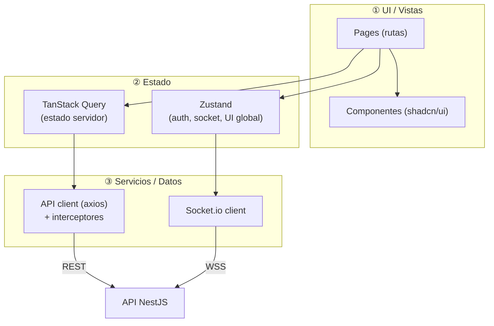
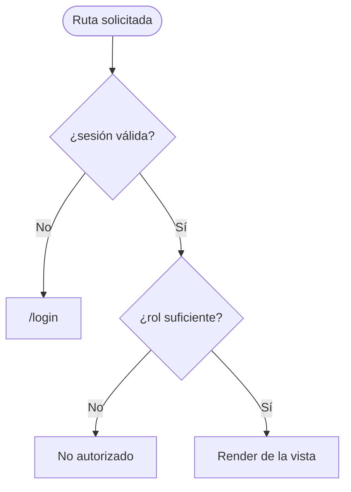
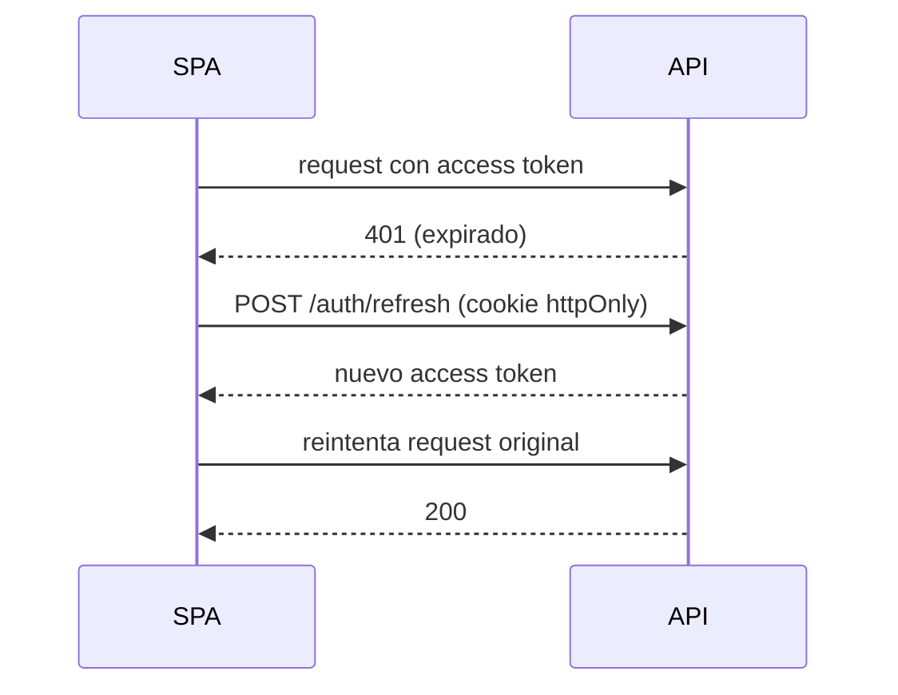
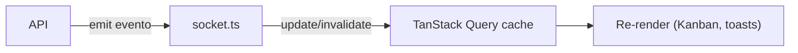
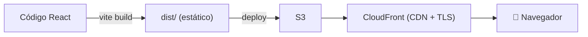

# 14 · Arquitectura de Software — Frontend (React)

[[00 - Índice|← Índice]] · [[12 - Frontend (Estructura y Vistas)|Vistas del panel →]]

SPA en **React + Vite + TypeScript**, privada tras login. Las **vistas** y la navegación están en [[12 - Frontend (Estructura y Vistas)]]; este documento cubre la **arquitectura** (capas, auth, estado, tiempo real, build).

## Capas del frontend



## Estructura de carpetas (propuesta)

```
src/
├── main.tsx
├── App.tsx                  # router + providers
├── routes/                 # definición de rutas y guards de ruta
├── pages/                  # una carpeta por vista (inbox, asignacion, asesores…)
├── components/             # UI reutilizable (tabla, selector de asesor, layout)
├── features/               # lógica por dominio (queries/mutations + componentes)
│   ├── inbox/
│   ├── asignacion/
│   ├── asesores/
│   ├── horarios/
│   └── ...
├── lib/
│   ├── api.ts              # cliente axios + interceptores (JWT, refresh)
│   ├── socket.ts           # conexión Socket.io
│   └── queryClient.ts      # config TanStack Query
├── stores/                 # Zustand (auth, ui)
├── hooks/                  # hooks compartidos
└── types/                  # tipos compartidos con el back (idealmente generados)
```

## Routing y rutas protegidas

- **React Router**. Layout con sidebar (ver sitemap en [[12 - Frontend (Estructura y Vistas)]]).
- **Guard de ruta:** componente `<RequireAuth role="OWNER">` que redirige a `/login` si no hay sesión y a un *not-authorized* si el rol no alcanza.
- Acceso por rol alineado con [[05 - Roles y Permisos]] (operador vs. owner).



## Autenticación en el cliente (JWT)

Alineado con el back ([[13 - Arquitectura de Software (Backend)]] §Auth):

- **Login** → recibe **access token** (en memoria / Zustand) y **refresh token** (cookie httpOnly puesta por el back).
- **API client (axios):** interceptor de request añade `Authorization: Bearer <access>`.
- **Interceptor de response:** ante `401`, intenta `POST /auth/refresh` (usa la cookie) y reintenta la petición original una vez; si falla, cierra sesión.
- El access token **no** se guarda en `localStorage` (mitiga XSS); el refresh va en cookie httpOnly.



## Estado de la aplicación

| Tipo de estado | Herramienta | Ejemplos |
|---|---|---|
| **Estado de servidor** | TanStack Query | lista de conversaciones, asesores, horarios, métricas |
| **Estado global de UI** | Zustand | usuario en sesión, conexión de socket, IA global on/off, toasts |
| **Estado local** | `useState`/`useReducer` | formularios, modales, filtros de una vista |

- **TanStack Query** maneja cache, revalidación y *optimistic updates* (ej. mover tarjeta en el Kanban).
- Las **mutaciones** (asignar, reasignar, CRUD asesores) invalidan las queries afectadas.

## Tiempo real (Socket.io)

- Conexión autenticada (token) al montar la app; se guarda en el store.
- **Eventos entrantes:** nuevo mensaje, cambio de estado de conversación, nuevo lead, escalamiento, SLA vencido.
- Al recibir un evento, se **actualiza la cache de TanStack Query** (o se invalida) para reflejar en vivo el Kanban y alertas.



## Tipos compartidos back ↔ front

Para evitar divergencias, **generar tipos** desde el back (p. ej. DTOs/OpenAPI o un paquete compartido) en lugar de redefinirlos a mano. *(Decisión a fijar al iniciar el repo.)*

## Build y despliegue



- **Vite** genera estáticos → **S3 + CloudFront** (ver [[07 - Infraestructura]]).
- Variables de entorno de build (`VITE_API_URL`, `VITE_WS_URL`) por entorno.
- SPA con *fallback* a `index.html` (rutas del lado cliente) configurado en CloudFront.

## Pendientes

- Confirmar **Zustand vs. Context** para estado global (recomendado Zustand por simplicidad).
- Estrategia de **generación de tipos** compartidos.
- Diseño visual / wireframes (Figma) — ver [[10 - Registro de Decisiones]].
