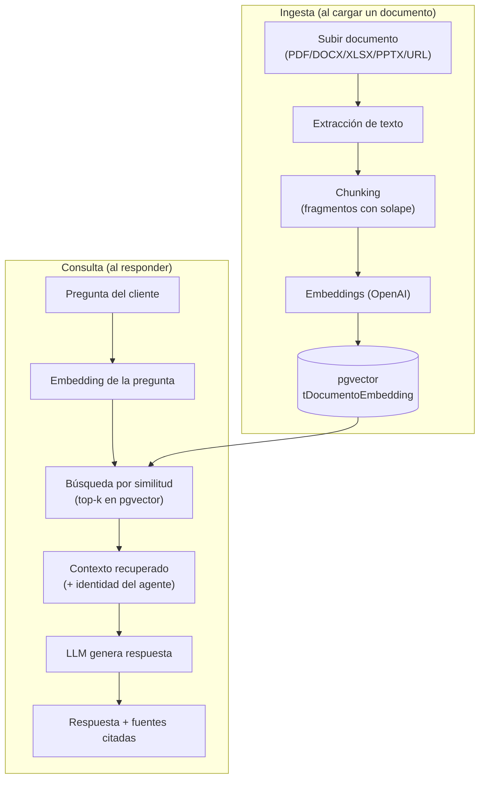
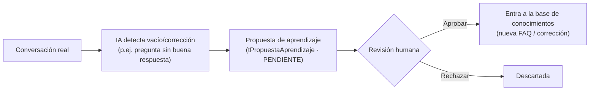

# 15 · Base de Conocimientos (RAG)

[[00 - Índice|← Índice]]

El **agente IA** no responde "en frío": se apoya en una **base de conocimientos** propia de CrossHome para contextualizar sus respuestas (catálogos, políticas, manuales, FAQs, identidad de la empresa). Esta es la pieza que eleva la calidad del agente y lo diferencia de un bot genérico.

> **Referencia:** propuesta de Gazeti AI a CrossHome (https://www.gazeti.net/es/gazeti-ai/agentes). Capacidades a igualar/superar: ingestión de **políticas/manuales** (PDF/DOCX/XLSX/PPTX) con extracción automática, organización en "cerebro" (chunks), respuestas con **trazabilidad de la fuente**, **autoaprendizaje supervisado**, **memoria persistente por conversación** e **identidad multicanal**, y log de auditoría.

## Qué conocimiento debe tener el agente

| Tipo | Ejemplos | Uso |
|---|---|---|
| **Identidad / contexto** | Quién es CrossHome, tono de voz, valores, horarios, cobertura | Personaliza al agente; define cómo se presenta |
| **Políticas** | Crédito (Infonavit/Fovissste/bancario), comisiones, requisitos, apartados | Resolver dudas frecuentes con precisión |
| **Manuales / procesos** | Pasos de compra/renta, documentación, agenda de visitas | Guiar al cliente |
| **FAQs** | Preguntas frecuentes y sus respuestas | Respuesta rápida y consistente |

> **No hay catálogo de propiedades en el sistema.** Las propiedades se gestionan en sus **portales** correspondientes; el agente solo enruta por la **clave del inmueble** (ver [[Flujos/02 - Intake y Obtención de Clave]]), no describe inventario. La base de conocimientos es para **información general** (identidad, políticas, procesos, FAQs).

## Arquitectura RAG (Retrieval-Augmented Generation)

- **Embeddings + pgvector** en la misma PostgreSQL (sin vector DB aparte). Búsqueda vía `prisma.$queryRaw` (ver [[13 - Arquitectura de Software (Backend)]] §Prisma).
- El **contexto del agente** (identidad/tono/reglas) se inyecta en el *system prompt* y se beneficia de **prompt caching** (ver [[08 - Costos]]).

## Contexto / identidad del agente (configurable)

Bloque editable que define el comportamiento base del agente, independiente de los documentos:

- **Identidad:** nombre del asistente, empresa, tono (formal/cercano), idioma.
- **Reglas de negocio:** qué puede prometer y qué no, cuándo escalar a humano, no inventar precios/datos fuera del catálogo.
- **Límites:** no dar asesoría legal/financiera vinculante; pedir la clave del inmueble para asignar.
- **Horarios** (referencia para mensajes de fuera de horario).

## Autoaprendizaje supervisado

La IA **propone** mejoras al conocimiento; un humano (operador/owner) **aprueba o rechaza** antes de que entren en vigor.

> Mantiene el conocimiento **vivo y controlado**: nada entra sin validación humana.

## Memoria e identidad multicanal

- **Memoria persistente por conversación:** resumen/estado del hilo para dar continuidad.
- **Identidad multicanal:** un mismo contacto reconocido por teléfono/correo aunque escriba por distintos medios (match con `tCliente` y `tMapeoCRM`). Ver [[06 - Integraciones]].

## Trazabilidad y auditoría

- Cada respuesta de IA registra **qué fuentes/chunks** usó (citas) → confianza y depuración.
- Queda en `tLog` (`categoria = CONOCIMIENTO`) / metadatos del mensaje (RNF-03).

## Vigencia y gobierno del conocimiento

- Documentos con **estado de indexación** (pendiente/indexado/error) y **vigencia** (un catálogo viejo no debe usarse).
- **Re-indexar** al actualizar un documento; **desactivar** sin borrar (historial).
- Categorías/etiquetas para acotar la búsqueda por tipo.

## Fasing

- **MVP:** contexto/identidad del agente + FAQs y políticas básicas (carga de pocos documentos). RAG mínimo funcional.
- **Fase 2:** ingestión completa multi-formato, catálogo, autoaprendizaje supervisado, trazabilidad y dashboard de conocimiento. Ver [[09 - Fases y Roadmap]].

## Datos relacionados

Ver [[04 - Modelo de Datos]]: `tFuenteConocimiento`, `tDocumentoEmbedding`, `tPropuestaAprendizaje`.
Vista de gestión en [[12 - Frontend (Estructura y Vistas)]] §8.
