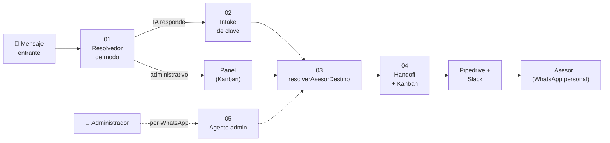

# 🔀 Índice de Flujos

[[00 - Índice|← Índice general]]

Diagramas de los flujos clave de Iris (Mermaid). Orden recomendado de lectura:

1. [[Flujos/01 - Mensaje Entrante (Resolvedor de Modo)|01 · Mensaje entrante (resolvedor de modo)]] — quién responde a cada mensaje.
2. [[Flujos/02 - Intake y Obtención de Clave|02 · Intake y obtención de clave]] — cómo la IA consigue la clave del inmueble.
3. [[Flujos/03 - Asignación (resolverAsesorDestino)|03 · Asignación (`resolverAsesorDestino`)]] — a qué asesor va el lead.
4. [[Flujos/04 - Handoff y Kanban de Recepción|04 · Handoff y Kanban de recepción]] — transición al asesor y estados del chat.
5. [[Flujos/05 - Agente IA Administrativo|05 · Agente IA administrativo]] — acciones de gestión por WhatsApp.

## Visión end-to-end

