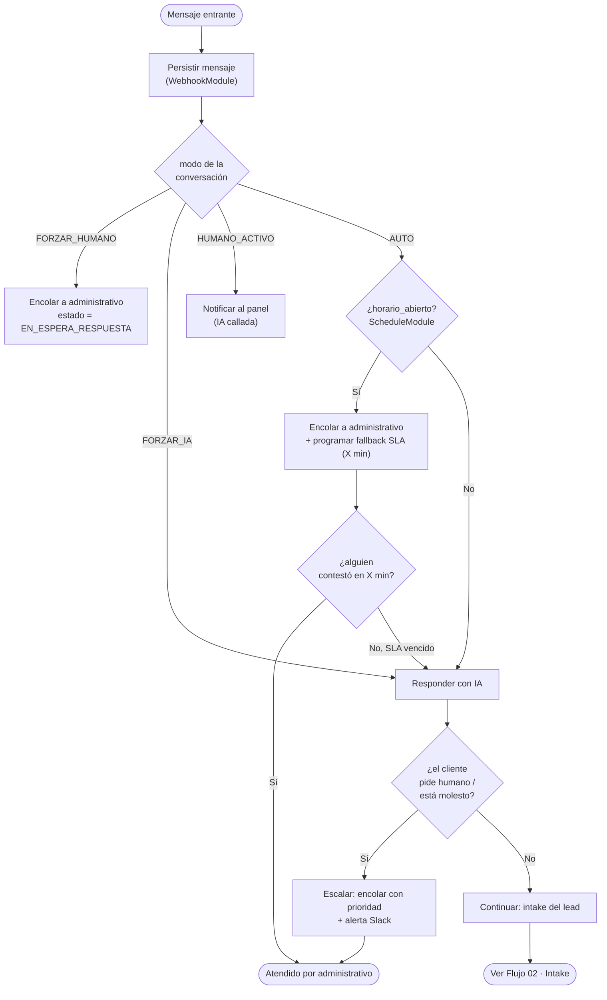

# 01 · Mensaje Entrante — Resolvedor de Modo

[[Flujos/00 - Índice de Flujos|← Índice de Flujos]]

El **RoutingModule** decide, por cada mensaje entrante, **quién responde** (IA o administrativo). Es el cerebro del sistema. La IA es un **modo**, no un motor permanente: nunca interrumpe a un administrativo activo.

## Modos de conversación (`tConversacion.modo`)

| Modo | Comportamiento |
|---|---|
| `AUTO` | Sigue el horario laboral (valor por defecto) |
| `HUMANO_ACTIVO` | Un administrativo la tomó; la IA permanece en silencio |
| `FORZAR_IA` | IA siempre, aun en horario (con `caduca_en` opcional) |
| `FORZAR_HUMANO` | Siempre humano, aun fuera de horario (ej. cliente VIP) |

`caduca_en` resuelve la activación **por tiempo específico**: el administrativo activa la IA "hasta las 16:00" y a esa hora la conversación vuelve sola a `AUTO`.

## Diagrama

## `horario_abierto()` (ScheduleModule)

Evalúa, en la **zona horaria configurada**:
1. `tHorario` del día (varias filas → turnos partidos y descansos, ej. hora de comida).
2. `tExcepcion` de la fecha (`FESTIVO` / `CIERRE` / `HORARIO_ESPECIAL`).
3. Kill-switch global `ia_global_activa` (si está apagada, la IA nunca responde).

## Casos cubiertos

| Caso | Resultado |
|---|---|
| Noche / fin de semana | IA responde, capta el lead |
| Hora de comida (hueco en el horario) | IA cubre automáticamente |
| Festivo / cierre | IA todo el día (vía `tExcepcion`) |
| Junta imprevista | Administrativo activa "IA hasta las 16:00" (`FORZAR_IA` + `caduca_en`) |
| Nadie contesta en horario | Fallback por SLA: la IA entra a los X min |
| Cliente pide humano / molesto en horario | IA detecta intención → encola con prioridad |

## Salida

- Si responde la **IA** y hay que captar al cliente → [[Flujos/02 - Intake y Obtención de Clave]].
- Si responde un **administrativo** → trabaja el chat en el [[Flujos/04 - Handoff y Kanban de Recepción|Kanban]].
