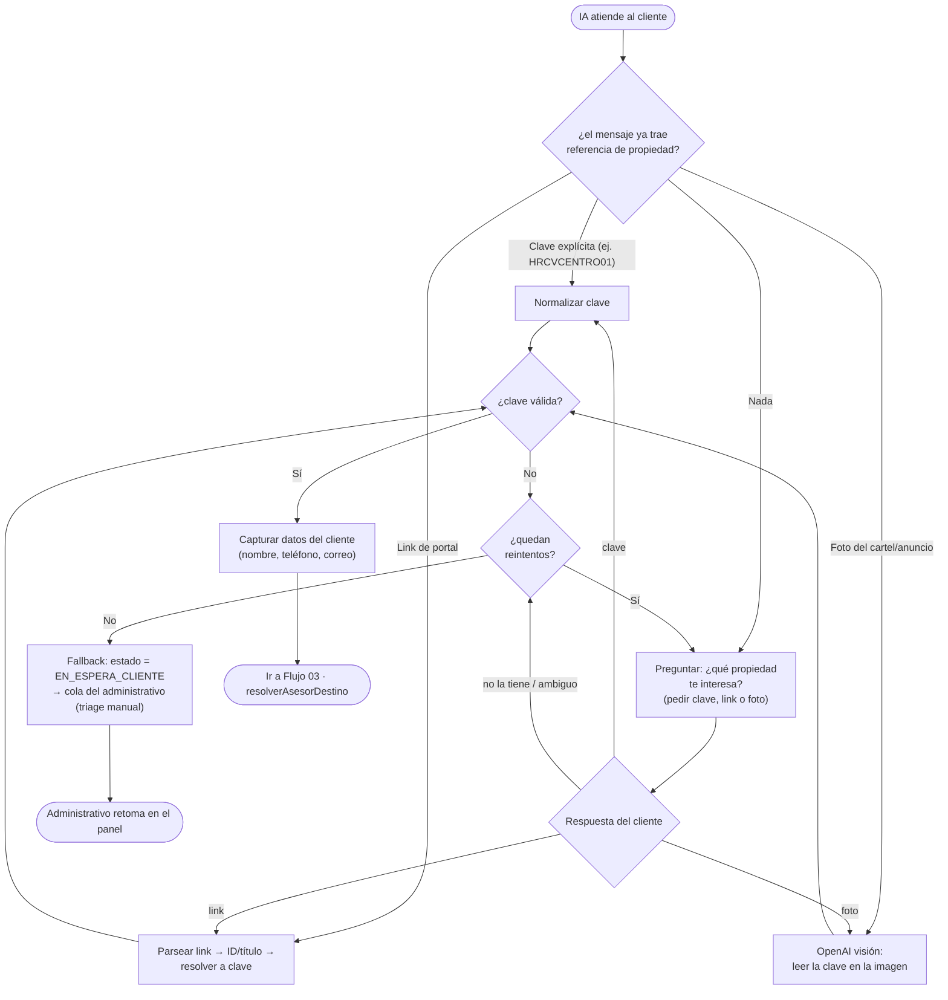

# 02 · Intake y Obtención de Clave

[[Flujos/00 - Índice de Flujos|← Índice de Flujos]]

A diferencia del flujo actual (el administrativo conoce la clave y la captura en un form), en WhatsApp **el cliente inicia y la clave no siempre viene**. Los leads llegan de múltiples medios: portales (Inmuebles24, Mercado Libre, Lamudi), recomendación, anuncio en la calle, **anuncio en la propiedad**, redes sociales.

El **agente IA** (BotModule) debe **resolver la clave del inmueble** antes de asignar.

## Diagrama

## Entradas que la IA sabe procesar

| Entrada | Cómo se resuelve a clave |
|---|---|
| **Clave dictada** | El cliente escribe la clave; se normaliza (mayúsculas, sin espacios) |
| **Link de portal** | Se parsea el link (Inmuebles24 / Mercado Libre / Lamudi) para obtener el identificador o título y mapearlo a la clave interna |
| **Foto del cartel / anuncio** | Modelo con **visión** lee la clave impresa en el letrero de la propiedad |
| **Descripción libre** | La IA pregunta y acota (zona, tipo, características) hasta poder identificar la propiedad/clave |

## Validación de la clave

La clave debe matchear el patrón `[2 letras asesor][2-3 letras tipo+negocio][identificador]`. Si no resuelve a una propiedad/asesor conocido tras los reintentos, el lead **cae a la cola del administrativo** (`estado = EN_ESPERA_CLIENTE`).

## Datos capturados (para Pipedrive y asignación)

- Nombre, teléfono (principal/secundario), correo.
- Clave del inmueble (→ asesor candidato).
- Medio de contacto / origen del lead.
- Notas / intención.

## Salida

Con la clave válida → [[Flujos/03 - Asignación (resolverAsesorDestino)]].
Sin clave → cola del administrativo en el [[Flujos/04 - Handoff y Kanban de Recepción|Kanban]].
