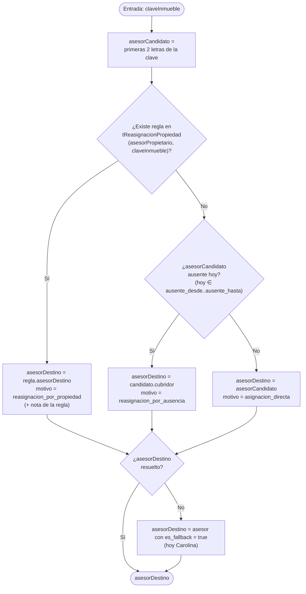
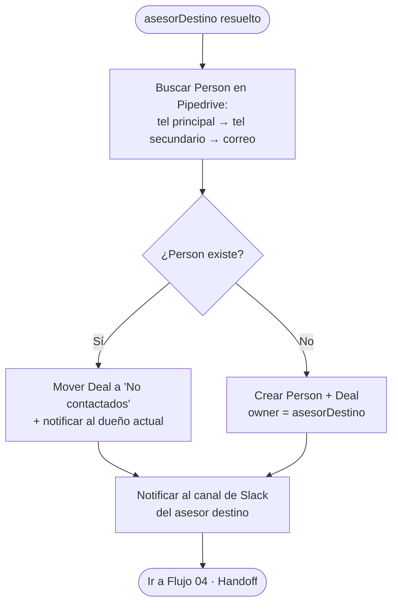

# 03 · Asignación — `resolverAsesorDestino`

[[Flujos/00 - Índice de Flujos|← Índice de Flujos]]

La asignación **NO es round-robin ni perfil por presupuesto/zona: la propiedad manda**. El asesor dueño del inmueble es el destino, salvo reglas de reasignación. Esta lógica ya opera hoy en automatizaciones Make/Integromat de CrossHome; **Iris la implementa nativa** (AssignmentModule) y reemplaza a Make.

## Clave del inmueble (fuente de la asignación)

Ejemplo: `HRCVCENTRO01`.

| Segmento | Significado | Ejemplo |
|---|---|---|
| 2 letras | **Iniciales del asesor dueño** | `HR` = Huascar Ramírez |
| 2-3 letras | **Tipo de propiedad + negocio** | `CV` = Casa Venta |
| Resto | Identificador de la propiedad | `CENTRO01` |

**Tipos de contrato:** `CR` Casa Renta · `CV` Casa Venta · `LR/LV` Local · `TR/TV` Terreno · `OR/OV` Oficina · `DR/DV` Departamento · `BR/BV` Bodega · `ER/EV` Edificio · `COR/COV` Consultorio.

> ⚠️ `COR` / `COV` (consultorio) tienen 3 letras y **solapan** con prefijos de 2 letras → requieren detección especial con `contains()`.

## Diagrama del algoritmo

> El **override manual** (operador elige el asesor al registrar/reasignar) tiene prioridad sobre todo el algoritmo.

## Datos de soporte (migran de Google Sheets a tablas)

| Origen (hoy, Sheet) | Destino (Iris) |
|---|---|
| `ASESORES` | `tAsesor` (iniciales, `pipedrive_id`, `slack_channel`, `es_fallback`, `ausente_desde/hasta`, `cubridor_id`) |
| `REASIGNACIONES_PROPIEDAD` | `tReasignacionPropiedad` (`asesor_propietario`, `clave_inmueble`, `asesor_destino`, `nota`) |

## Tras resolver el asesor: Pipedrive + Slack

## Salida

Lead asignado (owner en Pipedrive + aviso Slack) → [[Flujos/04 - Handoff y Kanban de Recepción]].
