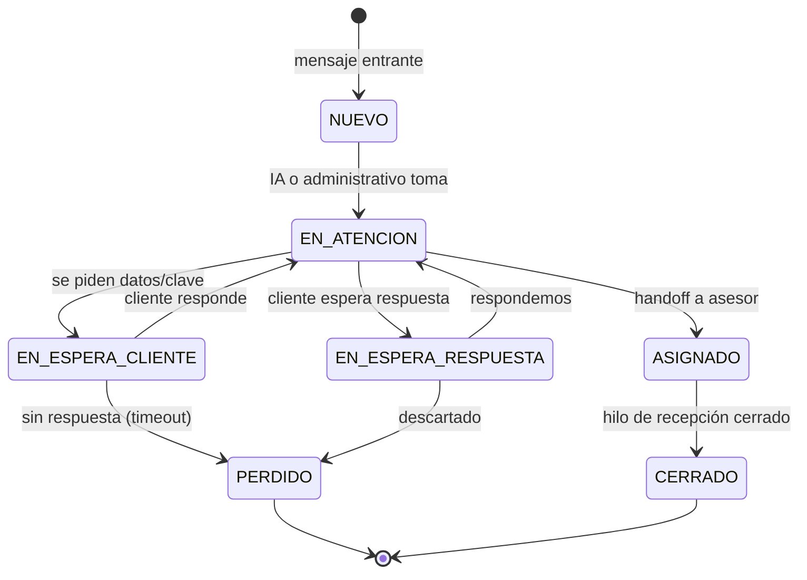
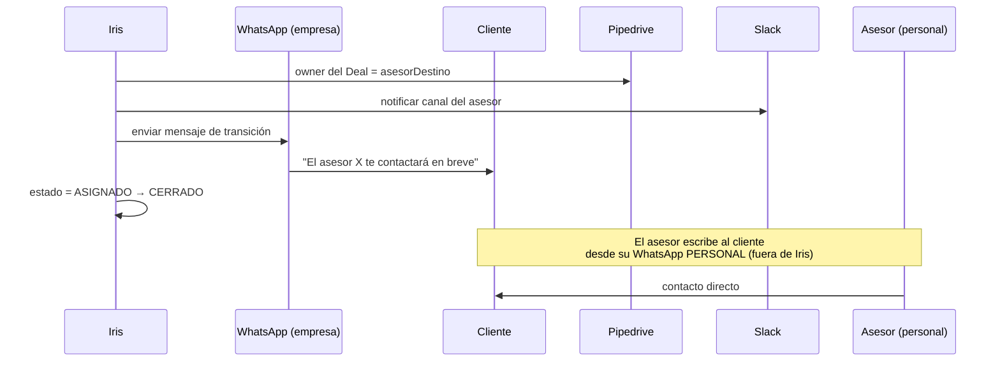

# 04 · Handoff y Kanban de Recepción

[[Flujos/00 - Índice de Flujos|← Índice de Flujos]]

El panel del administrativo **no es un simple inbox**: es un **tablero Kanban** donde cada conversación del número de empresa avanza por **estados de recepción** (`tConversacion.estado`). Esto **NO es el pipeline de Pipedrive** (ese gestiona el deal con el asesor) — aquí se gestiona el **estado del chat de recepción**. Por eso Iris no es un CRM.

## Estados (columnas del Kanban)

| Estado | Significado |
|---|---|
| `NUEVO` | Chat entrante sin atender |
| `EN_ATENCION` | IA o administrativo respondiendo |
| `EN_ESPERA_CLIENTE` | Se espera respuesta/datos del cliente (ej. la clave o foto del cartel) |
| `EN_ESPERA_RESPUESTA` | El cliente escribió y espera respuesta nuestra |
| `ASIGNADO` | Lead asignado a un asesor (handoff hecho) |
| `PERDIDO` | Cliente no respondió / descartado |
| `CERRADO` | Conversación de recepción finalizada |

## Diagrama de estados

## Handoff (al asignar el lead)

Cuando la IA o el administrativo asigna el lead a un asesor (Flujo 03), Iris ejecuta el **handoff**:

- **Mensaje de transición:** configurable (`tConfiguracionIA.mensaje_transicion`).
- **Cierre del hilo:** el chat pasa a `ASIGNADO` y luego `CERRADO`. Si el cliente vuelve a escribir al número de empresa, se abre un `NUEVO` (o se reabre, según configuración).

## Métricas que salen de aquí

El Kanban alimenta las métricas de **recepción**: leads captados, atendidos por IA vs. administrativo, tiempo de respuesta, asignados por asesor, perdidos. La **conversión** del lead se mide en **Pipedrive**, no en Iris.

## Relación con los modos

El `estado` (Kanban) es un eje **independiente** del `modo` (quién responde, [[Flujos/01 - Mensaje Entrante (Resolvedor de Modo)]]). Un chat `NUEVO` puede estar en `AUTO`, `FORZAR_IA`, etc.
