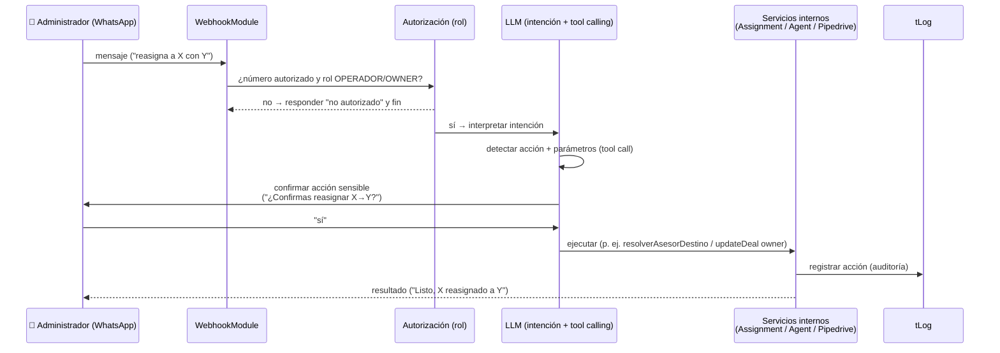

# 05 · Agente IA Administrativo (por WhatsApp)

[[Flujos/00 - Índice de Flujos|← Índice de Flujos]]

Además del agente de cara al cliente, Iris expone un **agente IA de cara al administrador por WhatsApp**: el operador/owner conversa en lenguaje natural y la IA **ejecuta acciones de gestión**, sin entrar al panel (AdminAgentModule).

## Acciones soportadas

| Acción | Ejemplo de instrucción |
|---|---|
| **Reasignar** un cliente a otro asesor | "Reasigna a Juan Pérez con Carolina" |
| **Asignar manualmente** un lead | "Asigna el cliente del 55-1234 a Héctor" |
| **Consultar estado** | "¿A quién está asignado el cliente X?", "¿Cuántos leads sin atender hay?" |
| **Marcar ausencia / cubridor** | "Pon a Gabriela ausente del 1 al 5 de julio, la cubre Ana" |

## Diagrama

## Seguridad (RNF-02 / RNF-03)

- El número del administrador debe estar **autorizado** y con **rol `OPERADOR` u `OWNER`**.
- Las acciones **sensibles** (asignación/reasignación, cambios de config) **confirman antes de ejecutar**.
- Toda acción queda registrada en `tLog` (`categoria = AGENTE_ADMIN`, auditoría).

## Implementación

- Detección de intención + **tool calling** del LLM contra los servicios internos.
- Las "tools" expuestas al LLM son envoltorios de los mismos servicios que usa el panel (AssignmentModule, AgentModule, PipedriveModule) → una sola fuente de lógica, dos interfaces (panel y WhatsApp).

## Relación con otros flujos

- Reasignar/asignar reutiliza [[Flujos/03 - Asignación (resolverAsesorDestino)]].
- Las acciones impactan el [[Flujos/04 - Handoff y Kanban de Recepción|Kanban]] y Pipedrive.
